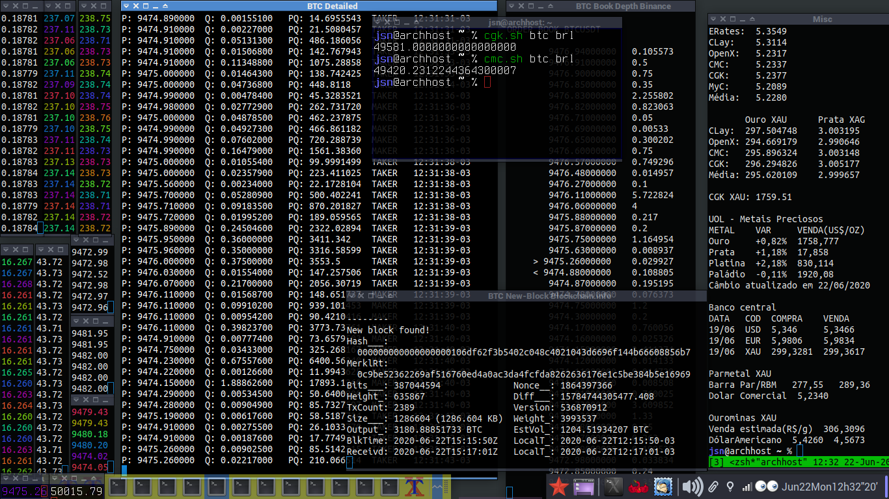

# markets
Shell scripts related to finance, stocks, and cryptocurrency

<!--

   
  Fig. 1. Scripts on display: binance.sh, bitfinex.sh, binfo.sh, bitstamp.sh, cgk.sh, cmc.sh and others.
-->

## INDEX / ÍNDICE

NAME | DESCRIPTION
:-------------|:-----------
[bakkt.sh](bakkt.sh) | Price and contract/volume tickers from bakkt public api
[binance.sh](binance.sh) |  Binance public API, crypto converter, prices, book depth, coin ticker
[brasilbtc.sh](brasilbtc.sh) | Fetches bitcoin rates from brazilian exchanges public apis. Puxa cotações de bitcoin de agências de câmbio brasileiras de apis públicas
[cgk.sh](cgk.sh) | <Coinggecko.com> public api, convert one crypto, bank/fiat currency or metal into any another, market ticker, cryptocurrency ticker. This is my favorite everyday-use script for all-currency rates!
[cmc.sh](cmc.sh) |  <Coinmarketcap.com> convert any amount of one crypto, bank/fiat currency or metal into any another, NON-public api access
[novad.sh](novad.sh) | Puxa dados das apis públicas da NovaDax brasileira. fetch public api data from NovaDax brazilian enchange
[stocks.sh](stocks.sh) | <Financialmodelingprep.com> latest and historical stock and major index rates
[uol.sh](uol.sh) | Fetches rates from uol service provider public api. Puxa dados de páginas da api pública do uol economia
[whalealert.sh](whalealert.sh) | Data from whale-alert.io free api with the latest whale transactions.
[yahooscrape.sh](yahooscrape.sh) | Scrape some Yahoo! Finance tickers

<!-- [myc.sh](myc.sh) | <Mycurrency.net> public api, central bank currency rate converter -->
<!--
[ourominas.sh](ourominas.sh) | Ourominas (precious metals exchange) rates public api. Pega taxas da api pública da Ouro Minas
[parmetal.sh](parmetal.sh) | Parmetal (precious metals exchange) rates public api. Pega taxas da api pública da Parmetal
-->

## API KEYS / CHAVES DE API

Some scripts require API keys.
Please create free API keys and add them to shell environment or set
them in the script head source code. Demo api keys were added to the scripts,
however they may stop working at any time or get rate limited quickly.

Alguns scripts requerem chaves de API.
Por favor, crie chaves de API grátis e as adicione no ambiente da shell
ou as configure na cabeça do código-fonte dos scripts. Chaves para fins
de demonstração foram adicionadas aos scripts, porém elas podem parar 
de funcionar a qualquer momento ou serem limitadas rapidamente.

## FURTHER HELP AND EXAMPLES / MAIS AJUDA E EXEMPLOS

Check script help pages with option -h.

Veja as páginas de ajuda dos scripts com a opção -h. 

## IMPORTANT / IMPORTANTE

None of these scripts are supposed to be used under truly professional constraints. Do your own research!

Nenhum desses scripts deve ser usado em meio profissional sem análise prévia. Faça sua própria pesquisa!

## SEE ALSO

Alexander Epstein's _currency_bash-snipet.sh_ uses the same API as _erates.sh_

<https://github.com/alexanderepstein>

MiguelMota's _Cointop_ for crypto currency tickers

<https://github.com/miguelmota/cointop>

8go's _CoinBash.sh_ for CoinMarketCap simple tickers (outdated)

<https://github.com/8go/coinbash> 

Brandleesee's _Mop: track stocks the hacker way_

<https://github.com/mop-tracker/mop>

Packages `units` and `qalc` (qalculate) also have got
bank currency rate convertion.

---

<!--
    Please consider sending me a nickle!  = )

        bc1qlxm5dfjl58whg6tvtszg5pfna9mn2cr2nulnjr
-->

